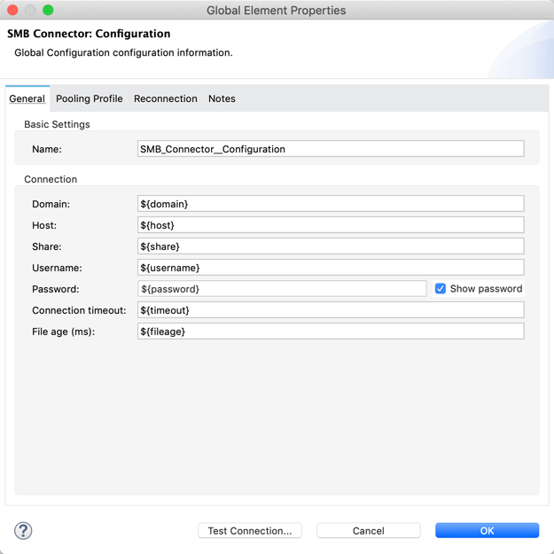
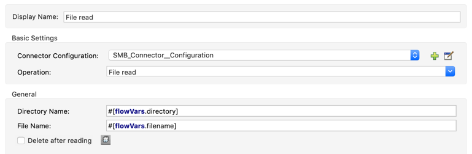
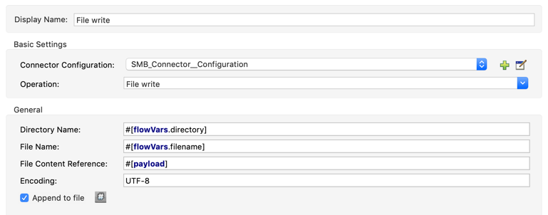
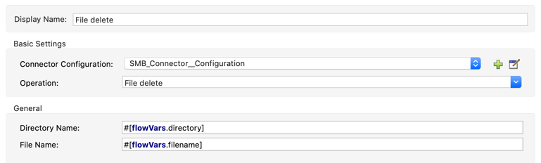
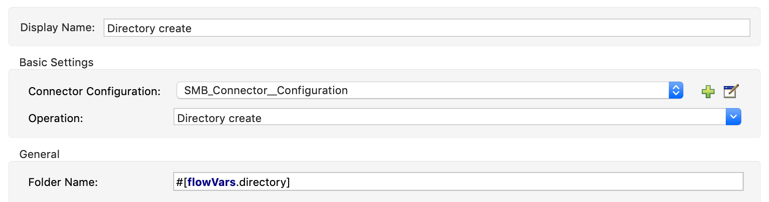
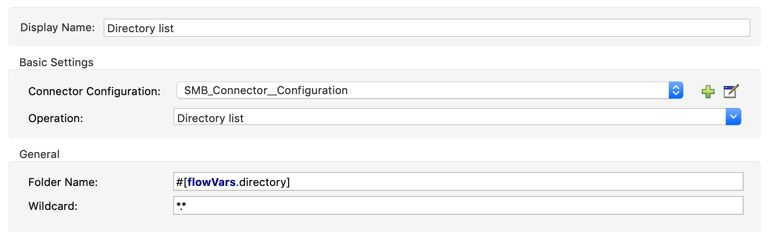
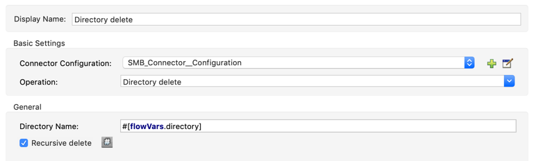

= SMB Connector
:toc:
toc::[]

[[overview]]
== Overview

Anypoint Connector for SMB provides the capability to perform operations (such as create directory, list directory contents, delete a directory, read a file, write a file, delete a file) against a Windows SMB share.

For details on this release see:

* link:/doc/release-notes.adoc[Connector Release Notes]

To configure a connector in Anypoint Studio follow this process:

1. Install the SMB connector.

2. Configure the SMB connector global element.

3. Configure an operation.

This document assumes that you are familiar with Mule, Anypoint Connectors, Anypoint Studio, Mule Concepts, and Global Elements.

[[install]]
== How to Install

You can install the connector in Anypoint Studio using the instructions in
link:https://docs.mulesoft.com/mule-runtime/3.9/installing-connectors[Installing Connectors].

If you are upgrading from a previous version of the connector, a small popup appears in the bottom right corner of Anypoint Studio with the "Updates Available" message. Click the popup and follow the prompts to install the latest version.

[[ns-schema]]
== Connector Namespace and Schema

When designing your application in Anypoint Studio, when you drag the connector from the palette onto the Anypoint Studio canvas, Studio automatically populates the XML code with the connector *namespace* and *schema location*.

* *Namespace*: `+http://www.mulesoft.org/schema/mule/smb+` +
* *Schema Location*: `+http://www.mulesoft.org/schema/mule/smb/current/mule-smb.xsd+`

[TIP]
If you are manually coding the Mule application in Studio's XML editor or another text editor, define the namespace and schema location in the header of your *Configuration XML*, inside the `<mule>` tag.

[source, xml, linenums]
----
<mule xmlns="http://www.mulesoft.org/schema/mule/core"
      xmlns:xsi="http://www.w3.org/2001/XMLSchema-instance"
      xmlns:connector="http://www.mulesoft.org/schema/mule/smb"
      xsi:schemaLocation="
               http://www.mulesoft.org/schema/mule/core
               http://www.mulesoft.org/schema/mule/core/current/mule.xsd
               http://www.mulesoft.org/schema/mule/smb
               http://www.mulesoft.org/schema/mule/smb/current/mule-smb.xsd">

      <!-- put your global configuration elements and flows here -->

</mule>
----

NOTE: Use `current` in the schema path. Studio interprets this to the current Mule version.

[[maven]]
== Maven Dependency Information

For Maven dependency management, include this XML snippet in your `pom.xml` file.

[source,xml,linenums]
----
<dependency>
    <groupId>org.mule.modules</groupId>
    <artifactId>mule-module-smb</artifactId>
    <version>1.2.0</version>
</dependency>
----

Inside the `<version>` tags, put the desired version number, the word `RELEASE` for the latest release, or `SNAPSHOT` for the latest available version.

[[configure]]
== How to configure

1. Drag and drop the connector to the Studio canvas.

2. Click the green plus sign to the right of Connector Configuration to configure a global element.

3. Enter the following values:

*Domain*: Enter a Windows domain for the user to log in with.
*Host*: Hostname of server hosting SMB share.
*Share*: Named path of the SMB share.
*Username*: Enter the username to log in with. Setting the value to "guest" indicates that guest connectivity should be used and no password is required. Setting the value to "anonymous" indicates that anonymous connectivity should be used and no password is required. These values are reserved to indicate these access types.
*Password*: Enter the corresponding password.
*Connection timeout*: Timeout for connection, in milliseconds.
*File age*: Age of file required to perform operations on it, in milliseconds.

If using property placeholders this is configured as follows:

4. After setting the Global Element Properties, select *Ok* to save.

5. Select an Operation and configure the operation properties as follows. 

[[Operations]]
== Operations

The operations for this connector can be wrapped in a poll scope at the start of a flow or used mid-flow to perform their respective action.

=== File read

Reads the contents of a file from the SMB share and returns a byte[] of the content, obeys minimum file age requirements.

*Required parameters*
Directory Name: Directory where file is located
File Name: Name of file to read in

*Optional*
Delete after reading: Checkbox to declare whether the file be deleted after reading

This is configured as follows:

=== File write

Writes the specified file content to a file on an SMB share, content can be provided as an InputStream, byte[] or String.

*Required parameters*
Directory Name: String |Directory where file is located
File Name: Name of file to write to
File content reference: Content to write to file
Encoding: Character encoding of contents to write

*Optional*
Append to file: Should the content be appended to the file otherwise overwrite content

This is configured as follows:

=== File delete

Delete the specified file from the SMB share, returns true if successful and obeys minimum file age requirements.

*Required parameters*
Directory Name: String |Directory where file is located
File Name: String |Name of file to delete

This is configured as follows:

=== Directory create

Create the specified directory on the SMB share, returns true if successful.

*Required parameters*
Directory Name: Name of directory to create

This is configured as follows:

=== Directory list

List the contents of specified directory from the SMB share, results include only items that are older than the minimum file age.

*Required parameters*
Directory Name: Name of directory to search in

*Optional*
Wildcard: DOS style wildcard filter

This is configured as follows:

=== Directory delete

Delete the specified directory from the SMB share, returns true if successful.

*Required parameters*
Directory Name: Name of directory to delete

*Optional*
Recursive delete: Checkbox to declare whether the delete be executed recursively

This is configured as follows:

